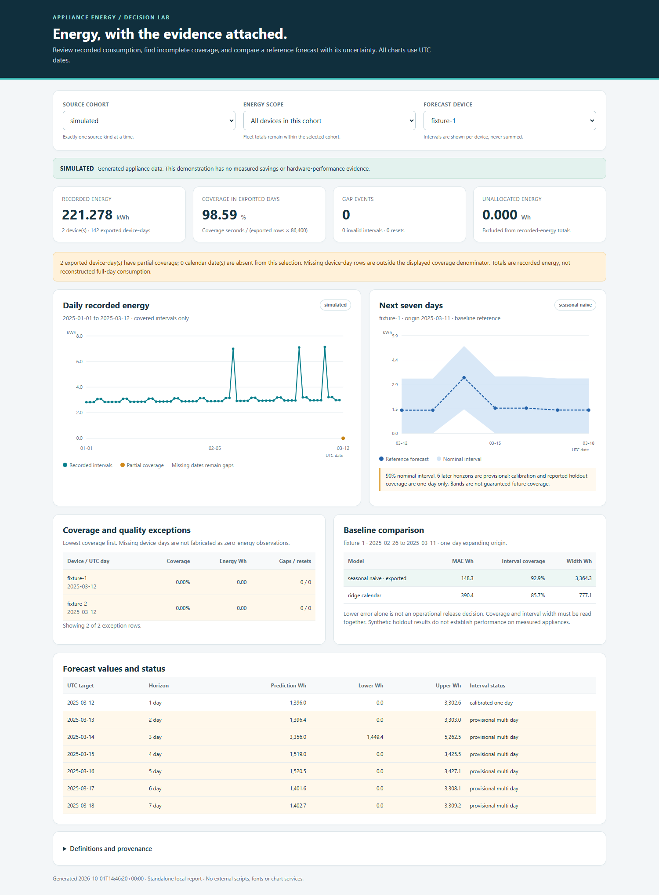
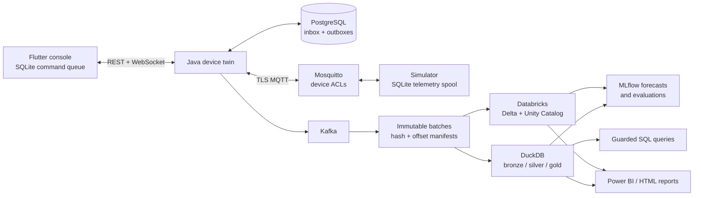

# Appliance Energy

A full-stack IoT control and energy analytics project: send commands reliably, trace device telemetry into a lakehouse, and investigate consumption with coverage-aware reports and forecasts.

Built around **Flutter, Java 21 / Spring Boot, PostgreSQL, TLS MQTT, Kafka, DuckDB, Databricks and MLflow**. A persistent simulator makes the complete software workflow runnable without appliance hardware.



## What it demonstrates

- **Control through disconnects.** The Flutter console saves commands in SQLite before dispatch. Retries reuse the original command ID and payload; revision checks, expiry and transactional outboxes preserve intent. A matching device report confirms the outcome.
- **Telemetry that can be replayed.** Devices retain pending samples until an application receipt arrives. The exporter publishes immutable Kafka batches with hash and offset manifests; ingestion deduplicates event identities and quarantines conflicts.
- **Energy accounting with visible gaps.** Bronze/silver/gold processing separates observed consumption from unallocated intervals, preserves source cohorts and repairs aggregates when late observations arrive.
- **Evaluated forecasts and queries.** Temporal holdouts compare ridge regression with seasonal-naive, while MLflow records results and provenance. Six deterministic query intents and optional local Ollama SQL generation share a read-only SQL guard.

The fictional energy case asks: **Which devices need investigation, and how much energy should we expect next week?** Reports keep observation coverage, source labels and uncertainty alongside the answer.

## Architecture



See [architecture and failure boundaries](docs/ARCHITECTURE.md) and the [shared protocol](contracts/PROTOCOL.md) for command states, telemetry identities and recovery behavior.

## Try the analytics demo

Requires **Python 3.12** and [uv](https://docs.astral.sh/uv/). Run all commands below from the repository root:

```sh
uv sync --project analytics --locked --python 3.12
uv run --project analytics --locked python analytics/scripts/run_demo.py
uv run --project analytics --locked python scripts/build_dashboard.py --data analytics/artifacts/powerbi --output artifacts/energy-dashboard.html
```

Open `artifacts/energy-dashboard.html` in a browser. The demo generates two 70-day synthetic device histories, builds bronze/silver/gold tables, checks replay invariance, evaluates forecasts and queries, and exports report data. It runs locally without Docker, cloud credentials or a model download.

The dashboard filters source cohorts and shows consumption, observation coverage and device-specific forecast intervals. It is an exported snapshot. For commands, evaluation details and the optional attributed REFIT public-data adapter, see [local analytics](analytics/README.md).

### Optional: editable Power BI report

After the analytics demo, generate and validate the three-page report:

```sh
uv run --project analytics --locked python scripts/build_powerbi.py --data analytics/artifacts/powerbi --output artifacts/powerbi
uv run --project analytics --with jsonschema==4.25.1 python scripts/validate_powerbi.py artifacts/powerbi
```

Open `artifacts/powerbi/Energy.pbip` in Power BI Desktop and refresh its local CSV imports. The pages cover energy, coverage/missing data, and forecasts. The [Power BI guide](powerbi/README.md) also describes the Databricks connector variant.

## Run the control and telemetry stack

Requires **Docker with Compose**, Python 3.12 and uv. Start Docker before bootstrapping. The first run downloads dependencies and container images.

```sh
uv sync --project simulator --locked --python 3.12
uv run --project simulator --locked python scripts/bootstrap.py --devices 100
docker compose up -d --build --wait
uv run --project simulator --locked python scripts/with_env.py uv run --project simulator --locked python scripts/smoke.py
```

If the API is still starting, wait for the backend startup message before running the smoke test. Bootstrap creates a local CA, per-device broker credentials and an operator token in ignored `.runtime/` and `.env` files. Subsequent runs preserve existing credentials. Keep these files private.

Run ten simulated devices for one minute, then export the Kafka backlog:

```sh
uv run --project simulator --locked python scripts/with_env.py uv run --project simulator --locked appliance-simulator run --count 10 --interval 2 --duration 60
uv run --project simulator --locked appliance-simulator export --once
```

Batches appear under `data/batches/` before consumer offsets are committed. The exporter resumes from committed offsets; `--once` exits after three empty polls and may keep running while a fleet continuously publishes.

To exercise the operator UI, follow the [Flutter console setup](mobile/README.md), open `http://127.0.0.1:8090`, select backend `http://127.0.0.1:18080`, and enter the operator token from your local `.env`. The token stays in memory. Keep the same browser origin to recover the command queue after a reload.

Then ingest those actual transport batches into a separate analytics database:

```sh
uv run --project analytics --locked python analytics/scripts/verify_live_batches.py
```

Stop services with `docker compose down`. Named volumes retain data. The [two-demo runbook](docs/DEMO.md) walks through offline command recovery and energy analysis.

## Validation and scope

The [validation record](docs/VALIDATION.md) links dated checks for the local software, browser recovery, Android emulator persistence, Databricks workflow, Power BI and temporary Azure deployment. It distinguishes executed checks from generated artifacts and unfinished work.

- **Software and simulator edition with a USB board bench.** The local transport uses real HTTP, TLS MQTT, PostgreSQL and Kafka. Reference dashboard and forecasting data remain synthetic. A GPIO-disabled NodeMCU V3 passed logical commands, bounded recovery and certificate-date checks; its 203 setpoint-estimated events passed a separate Databricks ingestion/model/replay check. Physical switching, measured energy and power-cut durability remain unverified. See [ESP8266 validation](firmware/esp8266/VALIDATION.md).
- **Measured limitations stay visible.** The forecasting challenger lost on the recorded synthetic holdouts, so the report retains seasonal-naive. Longer-horizon intervals remain provisional. These results establish neither real-appliance forecast accuracy nor energy savings.
- **Query safety and answer quality are evaluated separately.** The optional Ollama route can produce safe SQL with incorrect units, filters or results. Deterministic intents remain the default.
- **Local deployment.** This is a single-operator demonstration with host ports bound to loopback. Production operation, multi-tenant authorization and full physical appliance acceptance remain outside the verified scope.

The [recommendation memo](docs/RECOMMENDATION.md) explains the model and reporting decisions. Read [security boundaries](docs/SECURITY.md) before changing deployment exposure.

### Run tests

```sh
uv run --project simulator --locked pytest simulator/tests -q
uv run --project analytics --locked pytest analytics/tests -q
```

Backend integration tests require a disposable PostgreSQL database and deliberately clear its application tables. Component READMEs document backend, Flutter and firmware checks; the [verification workflow](.github/workflows/verify.yml) runs the automated suites. The transport smoke test exercises real brokers separately.

## Explore the source

| Component | Contents |
| --- | --- |
| [Backend](backend/README.md) | Java device twin, PostgreSQL inbox/outboxes, authenticated REST and WebSockets |
| [Simulator](simulator/README.md) | Persistent devices, telemetry receipts, fleet runner and Kafka export |
| [Flutter console](mobile/README.md) | Web/Android operator UI and persistent offline command queue |
| [Analytics](analytics/README.md) | DuckDB lakehouse, forecasts, anomalies and query evaluations |
| [Databricks](databricks/README.md) | Delta/Unity Catalog notebooks and sequential job bundle |
| [ESP32 firmware](firmware/README.md) | ESP-IDF implementation, BLE provisioning and signed OTA profiles |
| [ESP8266 firmware](firmware/esp8266/README.md) | Separate C target with TLS MQTT, durable state and telemetry |
| [Infrastructure](infra/README.md) | Azure deployment tooling and prepared Kubernetes manifests |

For the project narrative, see the [business brief](docs/BRIEF.md), [capability matrix](docs/FEATURES.md) and [six-slide presentation](docs/presentation.html).

## License and data

Original project source is [MIT licensed](LICENSE). Third-party code retains its own licences; see [third-party notices](THIRD_PARTY_NOTICES.md). REFIT data retains its own attribution and CC BY 4.0 licence; see the [adapter documentation](analytics/README.md#public-refit-sample). Downloaded data, runtime credentials, model weights and generated build/report output are excluded from source control.
