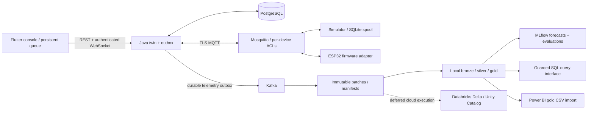

# Architecture and failure boundaries

The diagram distinguishes a tested local path from prepared cloud/physical adapters. The local analytics engine is DuckDB. It is not Delta or Unity Catalog; the Databricks implementation supplies those separate cloud behaviours.

## A command is an intent with an identity

The console commits UUID, expected revision, absolute power/speed and expiry to SQLite before sending. A lost HTTP response leaves the outcome uncertain. Receipt lookup and retry reuse the same payload; they do not manufacture a new UUID. Conflict requires an explicitly reviewed newer snapshot.

The backend locks the device row, validates the expected revision, and commits the command plus desired-state outbox in one PostgreSQL transaction. Identical retries return the existing receipt; changed payloads or competing revisions fail. An outbox attempt marker is persisted before delivery. A crash after delivery but before completion can resend the message.

The device fences stale revisions and persists absolute state before reporting. Reapplying `power=true, speed=37` is idempotent; an imperative `toggle` would not be. Only a matching state report confirms the command. Expiry following a possible dispatch means `outcome_unknown`. The system cannot guarantee that a physical effect happened exactly once across every power-loss boundary.

## A telemetry receipt means durable acceptance

PostgreSQL checks both event UUID and device/boot/sequence identity. Conflicting content is quarantined without modifying the accepted row. Telemetry, application-receipt outbox and Kafka outbox are committed together. MQTT protocol acknowledgement follows the database transaction.

Kafka publication and database completion cannot be atomic, so downstream duplicates remain possible. File export writes a checksummed batch before committing offsets. Bronze preserves raw evidence and provenance; silver validates identities and time/counter constraints; gold recomputes affected history to repair late arrivals. Replay is verified by row counts and energy totals, not by successful job exit alone.

## Energy accounting

Energy comes from differences within a device/boot/source cohort. Negative counters, excessive gaps, resets and invalid intervals cannot silently create observed energy. Valid intervals are allocated across UTC hour/day boundaries. Gaps contribute separate unallocated energy where applicable. Daily coverage qualifies comparisons and training eligibility. Cumulative counter readings are never summed as daily consumption.

## Models and queries

Forecasts use temporal calibration and untouched holdout periods. Seasonal-naive is a named baseline. Interval calibration and horizon status remain visible; a seven-day horizon does not inherit evidence from a one-day interval evaluation.

Query generation is separate from authorization. A SQL AST allowlist, approved gold views, read-only database, row limits and timeout constrain execution. Result comparison against independent expected queries evaluates semantic correctness. A safe SELECT can still use the wrong unit, filter or aggregation; model results therefore require review.
